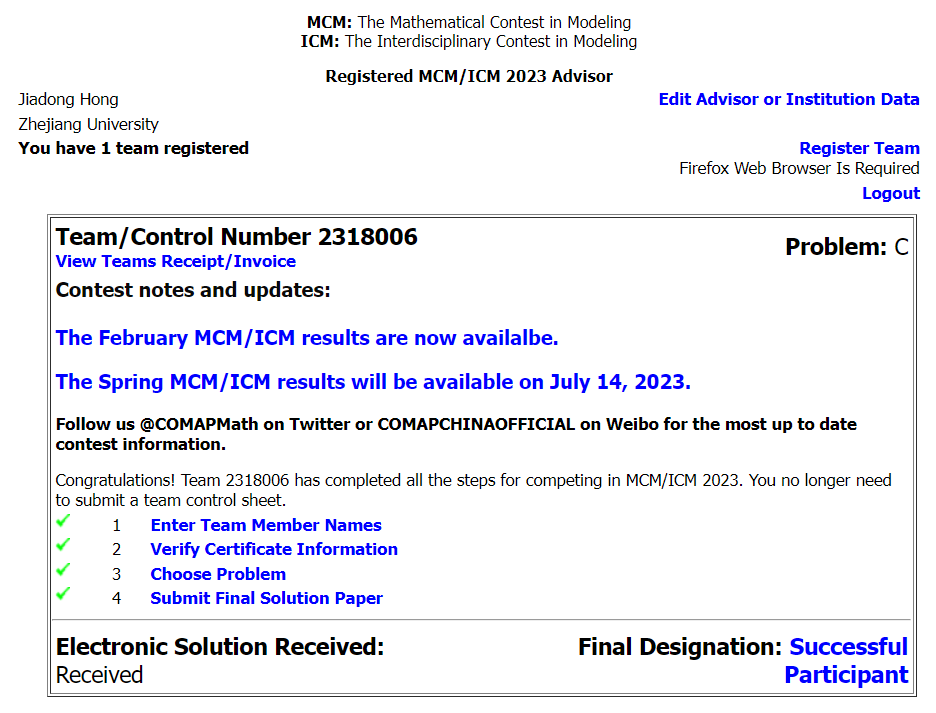
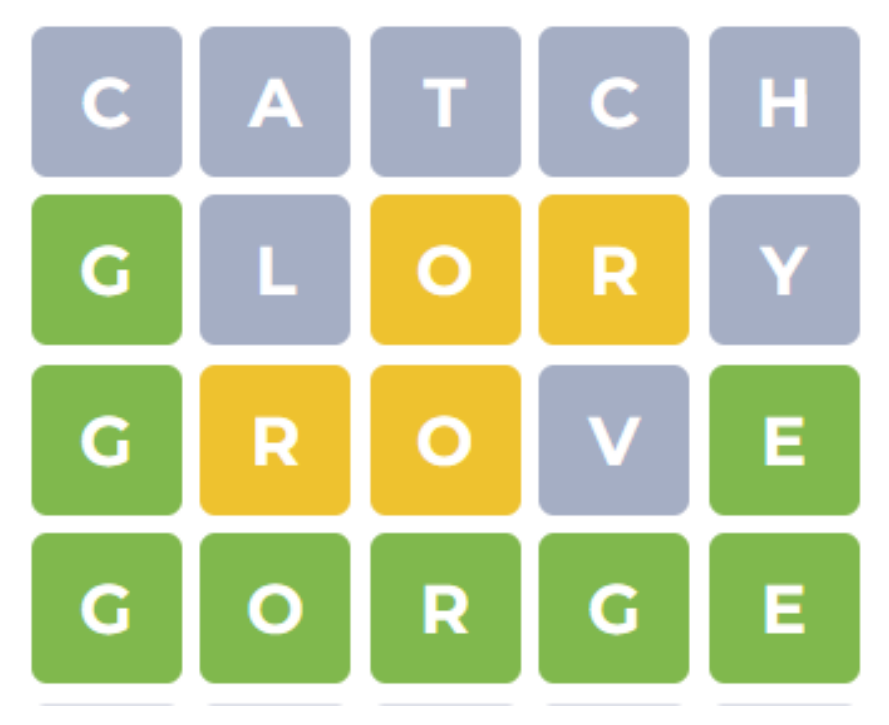

# mcm23

Part of code for Mathematical contest in modeling 2023 problem C.

The final designation is Successful Participant.

## Problem C Background

Wordle is an online popular word-puzzle game provided daily by The New York Times.
The main goal of this game is to solve a five-letter word (sometimes the word has four or six 
letters) within six tries or less by typing only existing words in English as their guesses.
For every try, the player will receive feedback with different colors. A green letter in one 
try means that the letter is in the correct location. A yellow letter indicates that the letter is in 
the wrong location, but it is exactly in the word. A gray letter represents that the letter is not in 
the word at all. Players also have chances to play this game in a “Hard Mode”, which requires 
players to mandatorily use green and yellow letters from previous tries in subsequent tries.

For the detailed problem description please refer to:
<a href= 'https://zhuanlan.zhihu.com/p/615471028' title = 'Description in Zhihu'>.

Here is a sample "Wordle" game:

## Summary of our work

### Data Pre-Processing

Observe the characteristics of the given data, delete the false data and mis-leading data.

### Problem 1: Two sub-questions.
#### Sub-question#1: 
Develop a model to explain the trend of the number of reported results over time and use this model to predict the number of reported results on March 1, 2023. 

**Future Report Quantity Forecast**: 

**Segmental Regression Analysis** in the time domain.

#### Sub-question#2: 
Will attributes of words affect the proportion of **“Hard Mode”** reports?

**Hypothesis Testing of  “Hard Mode” attribute**:

Introduce a new defined **Representation Difficulty Evaluation Coefficient** to roughly describe the difficulty, then do the hypothesis testing. we found out that the **“Hard Mode” would not affect the Representation Difficulty Evaluation Coefficient**.

### Problem 2: 
Develop a model to predict the associated percentage of tries that players use to win one game and use this model to predict the word EERIE on March 1, 2023. Evaluate this model.

**Word Linguistic Attribute Analysis**: **N-grams Analysis, Vowel numbers, etc.**:

The analysis detailed implementation is in [2_gram_analysis implementation 1](./2_gram_template.py) and [2_gram_analysis implementation 2](./2_gram.ipynb).

**Trial Distribution Prediction Model Given those Linguistic attribute**: 

**Backward-Propagation Neural Network**: basically use **SPSS software**.

### Problem 3: 

Develop a model to illuminate the difficulty of solution words and identify the difficulty of the word EERIE.

**Game Word Difficulty Classification Modeling**: 

**K-means++ Word Classification Model**

### Problem 4: 
Describe other features of the data set.

Referring to our [final report](./Report.pdf).
